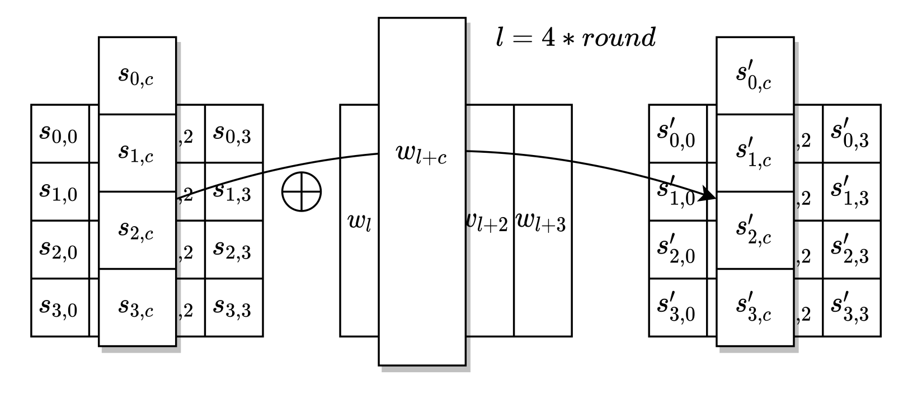

# AddRoundKey




```haskell
addRoundKey :: RoundKey -> State -> State
addRoundKey rk s = generate $ \ i ->
                   generate $ \ j ->
                      lkup s (i , j) ^ lkup rk (i , j)
```
