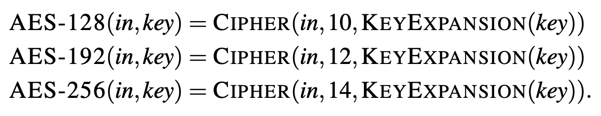

# AES Case Study

This section describes the correct-by-construction development of an AES-256 device in ReWire. Online resources that were used include:
  * [NIST FIPS 197](https://nvlpubs.nist.gov/nistpubs/FIPS/NIST.FIPS.197-upd1.pdf)
  * Cryptol was used as a *gold standard* to generate known answer tests:
      + Galois's [cryptol-specs](https://github.com/GaloisInc/cryptol-specs) repository contains a large number of formal specifications of cryptographic functions; and 
      + in particular, I used: [AES Specification in Cryptol](https://github.com/GaloisInc/cryptol-specs/blob/master/Primitive/Symmetric/Cipher/Block/AES/Specification.cry).

| Key Size | Key Length (Nk) | Block Size (Nb words) | Number of Rounds (Nr) |
| :-----------: | :------------: | :------------: | :------------: | 
| AES-128 | 4 | 4 | 10 | 
| AES-192 | 6 | 4 | 12 | 
| **AES-256** | 8 | 4 | 14 | 

## Basic Types for AES-256

In all three versions of this algorithm, the word size is 32 bits, which is expressed in ReWire as `W 32`.

Below is a listing of the type declarations for AES-256. The `State` is an intermediate result "of the AES block cipher that is represented as a two-dimensional array of bytes with four rows and Nb columns" which is defined as a vector of byte-vectors. Similarly, both a `Column` and a `RoundKey` are 4-vectors of bytes. A `KeySchedule` is an array of \\(Nb * (Nr + 1)\\) words, which, for AES-256, is an array of 60 words.
```haskell
-- |
type Key         = W 256
type State       = Vec 4 (Vec 4 (W 8))
type Column      = Vec 4 (W 8)
type RoundKey    = Vec 4 (Vec 4 (W 8))
-- | For AES-256, Nb * (Nr + 1) = 60, hence the key schedule has 60 elements:
type KeySchedule = Vec 60 (W 32)
```

### Defining the encryption function

In NIST FIPS-197, the encryption functions for each key size are defined as:



```haskell
-- 
-- This corresponds to Specification.cry's encrypt
-- 
encrypt256 :: Key -> W 128 -> State
encrypt256 k inp = cipher (initState inp) (keyexpand k)
```

```haskell
λ> :t cipher
cipher :: State -> KeySchedule -> State
λ> :t keyexpand
keyexpand :: Key -> KeySchedule
λ> :t initState
initState :: W 128 -> State
λ> 
```

### Built-in Operations

```haskell
generate :: KnownNat n => (Finite n -> a) -> Vec n a
```
