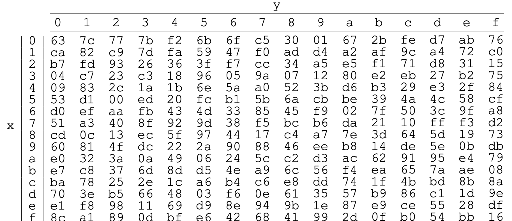

# RotWord \& SubWord

The rotate word, `RotWord`, and substitute word, `SubWord`, functions are defined in FIPS-197 as:


Both the `RotWord` and `SubWord` functions take a 32 bit word as input, viewed as four bytes. `RotWord`  rotates the bytes once to the left. The `SubWord` function takes FINISH THIS

## RotWord

The `rotword` function is defined in [RotWord.hs](https://github.com/harrisonwl/rwcrypto/blob/main/src/aes/RotWord.hs).

```haskell
rotword :: W 32 -> W 32
rotword w32 = toW32 (rot4 (toByte4 w32))
  where
    rot4 :: Vec 4 (W 8) -> Vec 4 (W 8)
    rot4 v4 = tail v4 `snoc` head v4

v4 :: Vec 4 (W 8)
v4 = fromList [lit 0 , lit 1 , lit 2 , lit 3]
```


This uses two helper functions defined in [Basic.hs](https://github.com/harrisonwl/rwcrypto/blob/main/src/aes/Basic.hs)
```haskell
toByte4 :: W 32 -> Vec 4 (W 8)
toW32   :: Vec 4 (W 8) -> W 32
```

## SubWord

The `subword` function is defined in [SubBytes.hs](https://github.com/harrisonwl/rwcrypto/blob/main/src/aes/SubBytes.hs) along with `subbytes` because they share the substitution box `SBox` (defined below).

```haskell
subword :: W 32 -> W 32
subword w32 = toW32 (sub4 (toByte4 w32))
  where
    -- | This is used later in the key expansion routine.
    sub4 :: Vec 4 (W 8) -> Vec 4 (W 8)
    sub4 bytes4 = generate $ \ i -> sbox (bytes4 `index` i)
```

```haskell
type SBox   = Vec 0x10 (Vec 0x10 (W 8))
type Index  = Finite 0x10
```

```haskell
mkix :: W 8 -> (Index , Index)
mkix b = (toFinite t4 , toFinite b4)
  where
     nibbles :: W 8 -> (W 4 , W 4)
     nibbles w = (take w , drop w)

     t4 , b4 :: W 4
     (t4 , b4) = nibbles b
  
sbox :: W 8 -> W 8
sbox w = lkup (mkix w)
   where
     
     lkup :: (Index , Index) -> W 8
     lkup (i , j) = (sboxTable `index` i) `index` j
```




```haskell
sboxTable :: SBox 
sboxTable = fromList [ r0 , r1 , r2 , r3 , r4 , r5 , r6 , r7 
                     , r8 , r9 , ra , rb , rc , rd , re , rf ]
  where
    r0, r1, r2, r3, r4, r5, r6, r7, r8, r9, ra, rb, rc, rd, re, rf :: Vec 0x10 (W 8)
    r0 = fromList [ lit 0x63, lit 0x7C, lit 0x77, lit 0x7B
	              , lit 0xF2, lit 0x6B, lit 0x6F, lit 0xC5
	              , lit 0x30, lit 0x01, lit 0x67, lit 0x2B
				  , lit 0xFE, lit 0xD7, lit 0xAB, lit 0x76 ]
                         ...deleted...
    rf = fromList [ lit 0x8C, lit 0xA1, lit 0x89, lit 0x0D
	              , lit 0xBF, lit 0xE6, lit 0x42, lit 0x68
				  , lit 0x41, lit 0x99, lit 0x2D, lit 0x0F
				  , lit 0xB0, lit 0x54, lit 0xBB, lit 0x16 ]
```
