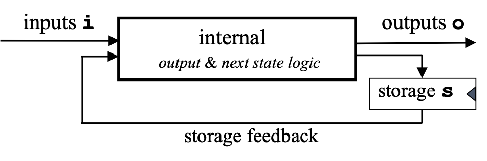

# ReWire for Verilog Programmers

This section presents a Verilog design for a UART (created by some AI agent) and rewrites it in ReWire. The structure of the resulting ReWire specification follows the structure of the Verilog design very closely. The codes for the UART is:
- [Verilog](../../code/chapter1/rtl_uart.sv)
- [ReWire](../../code/chapter1/TX_UART.hs)

Throughout this section, I'll focus on the ``uart_tx`` routine defined in ``rtl_uart.sv`` and demonstrate how Verilog code is translated into corresponding ReWire definitions. Recall from the beginning of this chapter that the type ``ReacT i o (StateT s Identity) ()`` corresponds to a Mealy machine:



The first thing to do is determine what the types ``i``, ``o``, and ``s`` are for the UART.

## Inputs

In the Verilog specification, here is the snippet defining the inputs:
```verilog
input clk,
input rst,
input tx_start,
input [7:0] tx_data,
```

Corresponding to this is the ReWire declaration ``I``. Only the ``clk`` signal is left out because it is already encoded by the reactive resumption monad structure. The first two inputs then are ``rst`` and ``tx_start``, which are both ``Bit``s, and ``tx_data``, which is an 8-bit word:
```haskell
data I = I { rst      :: Bit
           , tx_start :: Bit
           , tx_data  :: W 8 }
```

## FSM States

The UART transfer routing has four states, each of which is explicitly named:
```verilog
// FSM States
localparam IDLE      = 2'b00;
localparam START_BIT = 2'b01;
localparam DATA_BITS = 2'b10;
localparam STOP_BIT  = 2'b11;
```
In ReWire, these are expressed as a ``data`` declaration:
```haskell
data State = IDLE | START_BIT | DATA_BITS | STOP_BIT 
```

## Register File

Anything declared as a ``reg`` in Verilog is a register, some (``tx_pin`` and ``tx_done``) being also connected to outputs.
```verilog
output reg tx_pin,
output reg tx_done
reg [1:0] state;
reg [15:0] clk_count;
reg [2:0] bit_index;
reg [7:0] data_reg;
```

For each ``reg`` above, there is a corresponding tag in the following type ``RF``; note that ``RF uses Haskell's record syntax.
```haskell
data RF = RF { state     :: State
             , clk_count :: W 16
             , bit_index :: W 3
             , data_reg  :: W 8
             , tx_pin    :: Bit
             , tx_done   :: Bit }
```

### Initial Register File

```verilog
state     <= IDLE;
tx_pin    <= 1'b1;
tx_done   <= 1'b0;
clk_count <= 0;
bit_index <= 0;
```

```haskell
rf0 :: RF
rf0 = RF { state     = IDLE
         , tx_pin    = True
         , tx_done   = False
         , clk_count = lit 0
         , bit_index = lit 0
         , data_reg  = lit 0
         }
```

## Output Type

The following code defines the two outputs in ``rtl_uart.sv``:
```verilog
output reg tx_pin,
output reg tx_done
```
Therefore, the output type will be ``(Bit , Bit)``.
