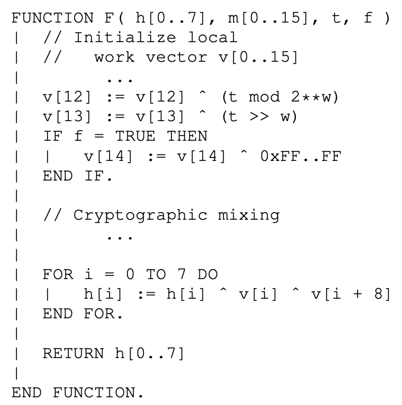

# Blake2b Case Study

The case study in this section concerns a correct-by-construction design and implementation of the Blake2b cryptographic hash function in ReWire. This case 

There are several relevant publications:
  1. [Temporal Staging for Correct-by-Construction Cryptographic Hardware.](https://bibbase.org/network/publication/forman-harrison-temporalstagingforcorrectbyconstructioncryptographichardware-2024) This paper was written by Yakir Forman and myself and published in the *Rapid Systems Prototyping Symposium* in 2024. This paper describes a reference semantics for Blake2b and a ReWire hardware design that comes directly from it. It also describes a formal verification in Coq of the correctness of the ReWire design. There are slides for this paper and (2) at the respective links.
  2. [Formalized High Level Synthesis with Applications to Cryptographic Hardware.](https://bibbase.org/network/publication/harrison-blumenfeld-bond-hathhorn-li-torrence-ziegler-formalizedhighlevelsynthesiswithapplicationstocryptographichardware-2023) This paper presents the mechanized semantics for ReWire on which the formal verification in (1) is based. 
  3. The RFP for Blake2 written by Markku-Juhani O. Saarinen and Jean-Philippe Aumasson. This is available here: [https://www.rfc-editor.org/info/rfc7693](https://www.rfc-editor.org/info/rfc7693). The reference semantics for Blake2b is a transliteration of this into Haskell/ReWire.

## Reference Semantics

The reference semantics is defined in terms of a state monad, `Storage`, that manages accesses to a register file, `RegFile`. There are 40 registers, each of which is a 64-bit word (i.e., `W 64` in ReWire). The `RegFile` itself is represented as a 40 element vector of `W 64` and individual registers are indices into this vector, represented by the `Finite 40` type.
```haskell
type Storage s = StateT s Identity
type RegFile   = Vec 40 (W 64)
type Reg       = Finite 40
```

Just as an example, consider the compression function `F` of Blake2b; here is its pseudocode:
<p align="center"></p>

```haskell
_F :: W 128 -> Bit -> Storage RegFile ()
_F t f = do
           init_local_work_vector
           v12 <== do { w <- readReg v12 ; return $ w ^ lowword t }
           v13 <== do { w <- readReg v13 ; return $ w ^ highword t }
           if f then
                  v14 <== do { w <- readReg v14 ; return $ w ^ lit 0xffffffffffffffff }
                else
                  return ()
           cryptographic_mixing
           xor_two_halves
```

```haskell
import Blake2b.Reference hiding (readH , _F , _BLAKE2b)
```
