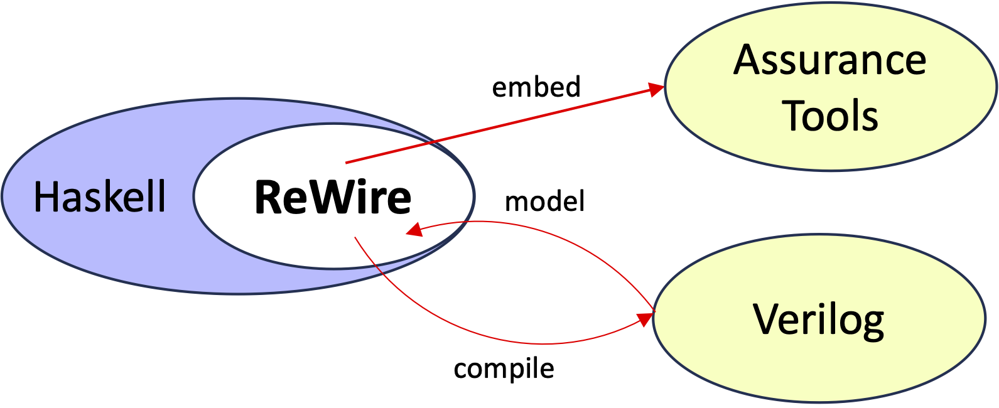

# ReWire by Example

The ReWire functional high-level synthesis language (see below) is a functional language for designing, verifying, and implementing high assurance hardware. 
* A hardware design in ReWire is also a Haskell program, and development of ReWire designs benefits from immediate feedback from its strong, static type system.
* As with Rust, ReWire's type system enforces invariants and guarantees at compile-time, thereby eliminating whole classes of bugs statically in a lightweight, automated manner. 
* ReWire's type system can be extended by embedding designs into assurance tools (like Coq) to capture broad of automated checks and proof tools. 
* ReWire designs can be compiled into Verilog and thereby interoperate with synthesis tools. 

ReWire is not a replacement for commodity hardware design languages like Verilog but rather it is a value-add for hardware design, implementation, and verification that interoperates with them.
