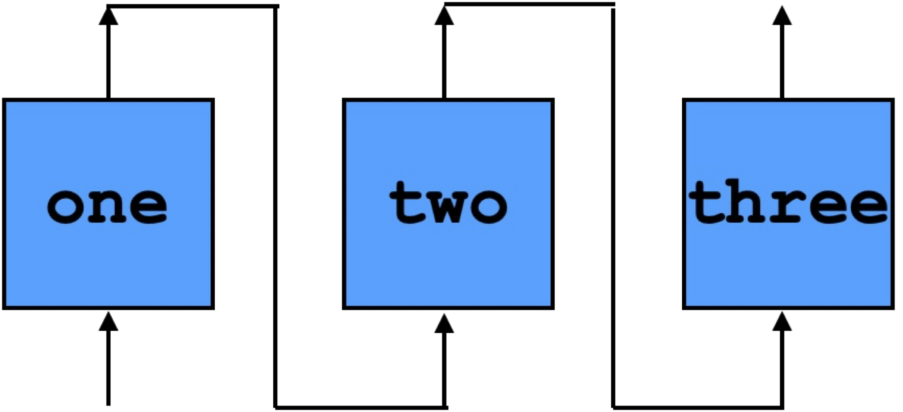

## A Hello World Example

As a simple example, consider the following three functions:
```haskell
one , two , three :: W 8 -> W 8
one x   = x + lit 1
two x   = x + lit 2
three x = x + lit 3
```

Composing these functions (`three . two . one`) produces a function that adds 6 to its argument.
Say we want to pipeline this composition so that, `one` is applied in the first cycle, `two` is applied to that result in the second cycle, and `three` is applied in the third cycle. 
For a given input `i`, `i + 6` is produced after the third cycle completes.
Graphically, this is:



Here is the ReWire code for pipelining `one`, `two`, and `three` so that it behaves as the table above. We will explain each function below.
On each cycle, each function  `one`, `two`, and `three` take an input and produce an output.
```haskell
times3 :: (W 8 , W 8 , W 8) -> (W 8 ,  W 8 , W 8)
times3 (i1 , i2 , i3) = (one i1 , two i2 , three i3)
```
The output for the pipelined device is the third output produced by `three`:
```haskell
out3 :: (a , b , c) -> c
out3 (_ , _ , x) = x
```
Given the current outputs, `(o1 , o2 , _)` and a new input to the pipelined device, we "shift right":
```haskell
conn3 :: (W 8 , W 8 , W 8) -> W 8 -> (W 8 ,  W 8 , W 8)
conn3 (o1 , o2 , _) ix = (ix , o1 , o2)
```


The main engine for all this is `pipeline`:
```haskell
pipeline :: Monad m => 
          (ii -> oi) -> (oi -> ox) -> (oi -> ix -> ii) -> oi -> ix -> ReacT ix ox m ()
pipeline f out conn oi ix = do
                              let ii = conn oi ix
                              let o = f ii
                              ix' <- signal (out o)
                              pipeline f out conn o ix'
```
While `pipeline` looks complicated, it's really pretty simple. Basically, `pipeline times3 out3 conn3` is the pipelined device portrayed above, although one has to provide it with the initial values for the output lines. It is significant to note that `pipeline` is ReWire code - i.e., it is not a special construct in the language, but, rather, is written in terms of the usual reactive resumption monadic operators.

The non-stalling version of the pipelined `three . two . one` is:
```haskell
nostall :: W 8 -> ReacT (W 8) (W 8) Identity ()
nostall = pipeline times3 out3 conn3 (lit 0 , lit 0 , lit 0)

start :: ReacT (W 8) (W 8) Identity ()
start = nostall (lit 99)
```
Here, the initial values `lit 99` and `(lit 0 , lit 0 , lit 0)` have no significance.


Running this pipelined version in GHCi, for example for inputs `[0x1..0xF]`, one would expect input/output pairs like:
```haskell
	(0x65,0x65) :> 
	(0x01,0x03) :> /* 1 input */
	(0x02,0x05) :> /* 2 input */
	(0x03,0x69) :> /* 3 input */
	(0x04,0x07) :> /* 7 = 1 + 6 output */	
	(0x05,0x08) :> /* 8 = 2 + 6 output */
	(0x06,0x09) :> /* 9 = 3 + 6 output */
	   ...
```

There are two versions of the code for this example:
  - [Haskell/ReWire version](https://github.com/harrisonwl/rwcrypto/blob/main/src/pipelining/NoStallPipe123.hs). This is executable in GHCi.
  - [ReWire version](https://github.com/harrisonwl/rwcrypto/blob/main/src/pipelining/RW_NoStallPipe123.hs). This is compilable by the ReWire compiler.
