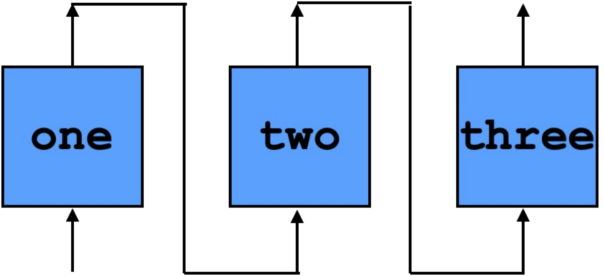

# Pipelining

Let's say you have three functions, `f`, `g`, and `h`. Obviously, you can compose them (`h . g . f` in Haskell).  It's a fairly common situation that one wants to compose them *temporally*---i.e., to pipeline them.
The idea is that, for each clock tick, there's one input `i`, and `h (g (f i))` is calculated over the next three ticks:

| Input | `f` | `g` | `h` | Output | 
| :-----------: | :------------: | :------------: | :------------: | :------------: |
| `i0` | `f i0` |  | | |
| `i1` | `f i1` | `g (f i0)` | | |
| `i2` | `f i2` | `g (f i1)` | `h (g (f i0))` | |
| `i3` | `f i3` | `g (f i2)` | `h (g (f i1))` | `h (g (f i0))` |
| \\(\vdots\\) | \\(\vdots\\)  | \\(\vdots\\)  | \\(\vdots\\) | \\(\vdots\\) |

Pipelining is a common hardware design technique for splitting large computations into smaller computations over time. ReWire makes such pipelining both easy to express and formally verify.

In the Salsa20 hash function ([Section 3.1.8](../salsa20/hashfunction.md)), there is a place where the `doubleround` function is composed ten times:
```haskell
dr10 :: Hex (W 32) -> Hex (W 32)
dr10 = doubleround . doubleround . doubleround . doubleround . doubleround .
          doubleround . doubleround . doubleround . doubleround . doubleround 
```
The `doubleround` function has a lot of arithmetic operations contained in it and its tenfold composition `dr10`, when unrolled into combinational logic, has many, many such operations. So, it's a good opportunity for pipelining.


## A Hello World Example

As a simple example, consider the following three functions:
```haskell
one , two , three :: W 8 -> W 8
one x   = x + lit 1
two x   = x + lit 2
three x = x + lit 3
```

Composing these functions (`three . two . one`) produces a function that adds 6 to its argument.
Say we want to pipeline this composition so that, `one` is applied in the first cycle, `two` is applied to that result in the second cycle, and `three` is applied in the third cycle. 
For a given input `i`, `i + 6` is produced after the third cycle completes.
Graphically, this is:



Here is the ReWire code for pipelining `one`, `two`, and `three` so that it behaves as the table above. We will explain each function below.
On each cycle, each function  `one`, `two`, and `three` take an input and produce an output.
```haskell
times3 :: (W 8 , W 8 , W 8) -> (W 8 ,  W 8 , W 8)
times3 (i1 , i2 , i3) = (one i1 , two i2 , three i3)
```
The output for the pipelined device is the third output produced by `three`:
```haskell
out3 :: (a , b , c) -> c
out3 (_ , _ , x) = x
```
Given the current outputs, `(o1 , o2 , _)` and a new input to the pipelined device, we "shift right":
```
conn3 :: (W 8 , W 8 , W 8) -> W 8 -> (W 8 ,  W 8 , W 8)
conn3 (o1 , o2 , _) ix = (ix , o1 , o2)

pipeline :: Monad m => (ii -> oi) -> (oi -> ox) -> (oi -> ix -> ii) -> oi -> ix -> ReacT ix ox m ()
pipeline f out conn oi ix = do
                            let ii = conn oi ix
                            let o = f ii
                            ix' <- signal (out o)
                            pipeline f out conn o ix'

nostall :: W 8 -> ReacT (W 8) (W 8) Identity ()
nostall = pipeline times3 out3 conn3 (lit 0 , lit 0 , lit 0)

start :: ReacT (W 8) (W 8) Identity ()
start = nostall (lit 99)
```

The main engine for all this is `pipeline`:
```haskell
pipeline :: Monad m => 
          (ii -> oi) -> (oi -> ox) -> (oi -> ix -> ii) -> oi -> ix -> ReacT ix ox m ()
pipeline f out conn oi ix = do
                              let ii = conn oi ix
                              let o = f ii
                              ix' <- signal (out o)
                              pipeline f out conn o ix'
```
While `pipeline` looks complicated, it's really pretty simple to explain. Its argument, `f : ii -> oi`,


Running this pipelined version in GHCi, for example for inputs `[0x1..0xF]`, one would expect input/output pairs like:
```haskell
	(0x65,0x65) :> 
	(0x01,0x03) :> /* 1 input */
	(0x02,0x05) :> /* 2 input */
	(0x03,0x69) :> /* 3 input */
	(0x04,0x07) :> /* 7 = 1 + 6 output */	
	(0x05,0x08) :> /* 8 = 2 + 6 output */
	(0x06,0x09) :> /* 9 = 3 + 6 output */
	   ...
```


We will use this as an opportunity for pipelining.


## Naive Approach

We can write perfectly valid ReWire code for in the same style as the first carry-save adder from ([Section 2.3](../chapter1/carrysaveadders.md)). That is, as a simple loop that takes an input, applies `dr10`, and `signal`s the output:
```haskell
type HxW32 = Hex (W 32)

dr10 :: HxW32 -> HxW32
dr10 = doubleround . doubleround . doubleround . doubleround . doubleround .
       doubleround . doubleround . doubleround . doubleround . doubleround 

loop :: Maybe HxW32 -> ReacT (Maybe HxW32) (Maybe HxW32) Identity ()
loop (Just hxw32) = signal (Just (dr10 hxw32)) >>= loop
loop Nothing      = signal Nothing >>= loop

start :: ReacT (Maybe HxW32) (Maybe HxW32) Identity ()
start = loop Nothing
```
The full code is available here: [Naive_DR10.hs](https://github.com/harrisonwl/rwcrypto/blob/main/src/pipeline/Naive_DR10.hs). If the `loop` function is passed a valid input (i.e., `(Just hxw32)`), then `dr10` is applied to it. In each cycle, `dr10 hxw32` is calculated.

*Why is this naive?* If you look at the code for `doubleround`, there are a lot of operations going on in `dr10`. Pure functions like these are compiled to combinational logic, and, the combinational logic for ten `doubleround`s is substantial. It would be better to pipeline calls to `doubleround` to avoid this.

There's another way that this is naive in that inputs and outputs include `Hex (W 32)` which is \\(16 \times 32 = 512\\) bits. This means that, on an FGPA, one would need 1024 input and output ports and that is (I believe) beyond what's currently available. We'll come back to this issue later on.

## The Plan
- Using the `doubleround` function, I'll demonstrate 2- and 5-stage pipelines of `dr10`.
- I.e., ReWire versions of:
```haskell
	pipe2 = [doubleround . doubleround . doubleround . doubleround . doubleround] .
               [doubleround . doubleround . doubleround . doubleround . doubleround]
	pipe5 = [doubleround . doubleround] . [doubleround . doubleround] . [doubleround .
               doubleround] . [doubleround . doubleround] . [doubleround . doubleround]
```
	


```haskell
λ> :t ins
ins :: [W 8]
λ> pretty ins
0x01 : 0x02 : 0x03 : 0x04 : 0x05 : 0x06 : 0x07 : 0x08 : 0x09 : 0x0A : 0x0B : 0x0C : 0x0D : 0x0E : 0x0F : []
λ> 
λ> pretty $ map (three . two . one) ins
0x07 : 0x08 : 0x09 : 0x0A : 0x0B : 0x0C : 0x0D : 0x0E : 0x0F : 0x10 : 0x11 : 0x12 : 0x13 : 0x14 : 0x15 : []
λ> pretty $ runP start (Stall , DC) (map Arg ins)
(Stall,DC) :> (Arg 0x01,DC) :> (Arg 0x02,DC) :> (Arg 0x03,DC) :> (Arg 0x04,Val 0x07) :> (Arg 0x05,Val 0x08) :> (Arg 0x06,Val 0x09) :> (Arg 0x07,Val 0x0A) :> (Arg 0x08,Val 0x0B) :> (Arg 0x09,Val 0x0C) :> (Arg 0x0A,Val 0x0D) :> (Arg 0x0B,Val 0x0E) :> (Arg 0x0C,Val 0x0F) :> (Arg 0x0D,Val 0x10) :> (Arg 0x0E,Val 0x11) :> (Arg 0x0F,Val 0x12) :+> Nothing
λ> 
```
