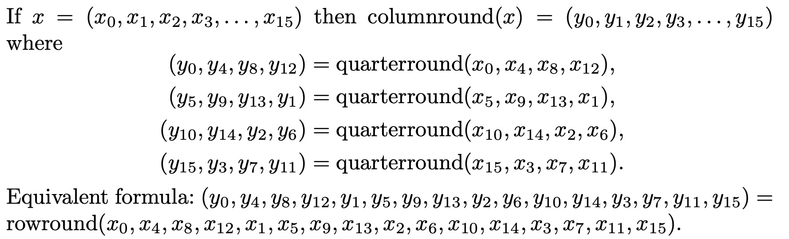
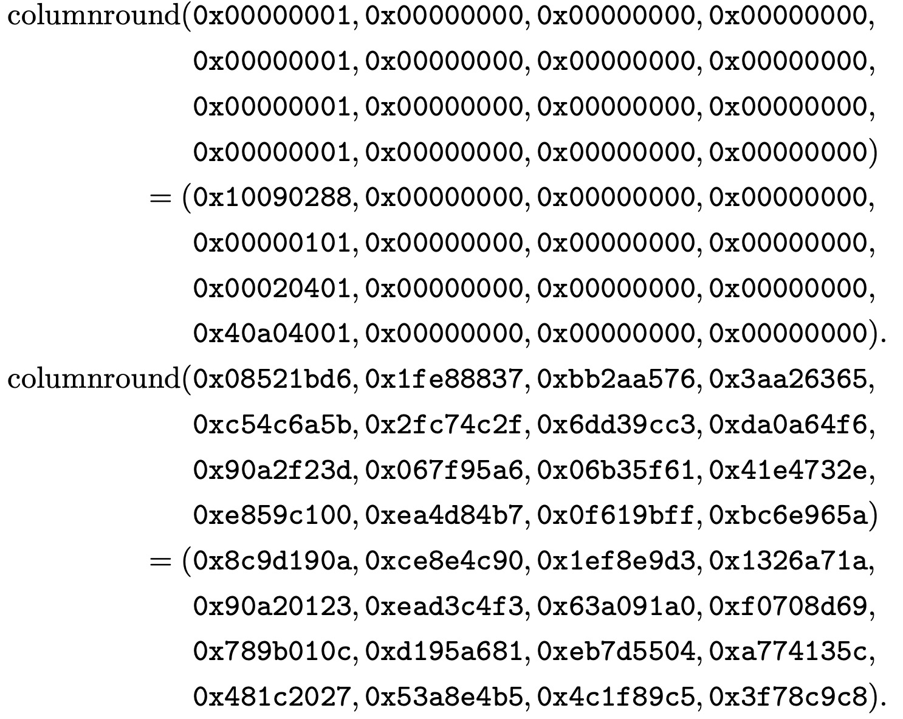

## The `columnround` function

The definitions below can be found in [ColumnRound.hs](https://github.com/harrisonwl/rwcrypto/blob/main/src/salsa20/ColumnRound.hs) and the testing code can be found in [Test_ColumnRound.hs](https://github.com/harrisonwl/rwcrypto/blob/main/src/salsa20/Test_ColumnRound.hs).

### Inputs and Outputs

If `x` is a 16-word sequence then `columnround(x)` is a 16-word sequence. Or, to put it in Haskell terms, the type of `columnround` is
```haskell
columnround :: Hex (W 32) -> Hex (W 32)
```
Here, we're assuming:
```haskell
type Hex a = X16 a
```
and that words are `W 32`.

### Definition

The `columnround` function from page 4 of Bernstein's *Salsa20 Specification* is given as:
<p align="center"></p>


## Rendering in ReWire/Haskell

```haskell
columnround :: Hex (W 32) -> Hex (W 32)
columnround (X16 x0 x1 x2 x3 x4 x5 x6 x7 x8 x9 x10 x11 x12 x13 x14 x15)
      = X16 y0 y1 y2 y3 y4 y5 y6 y7 y8 y9 y10 y11 y12 y13 y14 y15
     where
        y0, y1, y2, y3, y4, y5, y6, y7, y8, y9, y10, y13, y14, y15 :: W 32
        ( y0,  y4,  y8, y12) = quarterround (x0, x4, x8, x12)
        ( y5,  y9, y13,  y1) = quarterround (x5, x9, x13, x1)
        (y10, y14,  y2,  y6) = quarterround (x10, x14, x2, x6)
        (y15,  y3,  y7, y11) = quarterround (x15, x3, x7, x11)
```


## Examples

<p align="center"></p>

```haskell
alltests :: [Bool]
alltests = [test1 , test2]

test1 , test2 :: Bool
test1 = columnround (x16
                        0x00000001 0x00000000 0x00000000 0x00000000
                        0x00000001 0x00000000 0x00000000 0x00000000
                        0x00000001 0x00000000 0x00000000 0x00000000
                        0x00000001 0x00000000 0x00000000 0x00000000)
                        == x16
                              0x10090288 0x00000000 0x00000000 0x00000000
                              0x00000101 0x00000000 0x00000000 0x00000000
                              0x00020401 0x00000000 0x00000000 0x00000000
                              0x40a04001 0x00000000 0x00000000 0x00000000

test2 = columnround (x16
                        0x08521bd6 0x1fe88837 0xbb2aa576 0x3aa26365
                        0xc54c6a5b 0x2fc74c2f 0x6dd39cc3 0xda0a64f6
                        0x90a2f23d 0x067f95a6 0x06b35f61 0x41e4732e
                        0xe859c100 0xea4d84b7 0x0f619bff 0xbc6e965a)
                        == x16
                              0x8c9d190a 0xce8e4c90 0x1ef8e9d3 0x1326a71a
                              0x90a20123 0xead3c4f3 0x63a091a0 0xf0708d69
                              0x789b010c 0xd195a681 0xeb7d5504 0xa774135c
                              0x481c2027 0x53a8e4b5 0x4c1f89c5 0x3f78c9c8
```

And, as before, the tests are passed:
```haskell
λ> alltests
[True,True]
```
