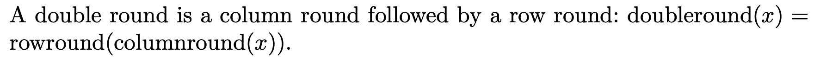
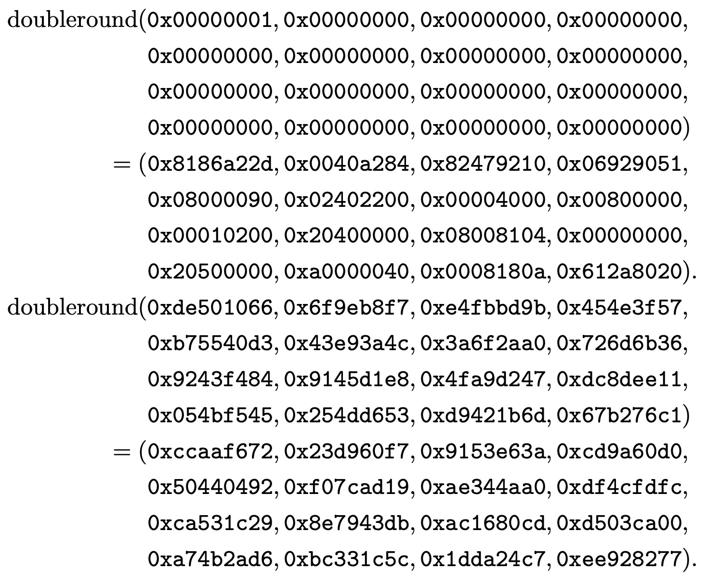

## The `doubleround` function

The definitions below can be found in [DoubleRound.hs](https://github.com/harrisonwl/rwcrypto/blob/main/src/salsa20/DoubleRound.hs) and the testing code can be found in [Test_DoubleRound.hs](https://github.com/harrisonwl/rwcrypto/blob/main/src/salsa20/Test_DoubleRound.hs).

### Inputs and Outputs

To quote Bernstein: *If `x` is a 16-word sequence then `doubleround(x)` is a 16-word sequence.* So, its Haskell type is given as:
```haskell
doubleround :: Hex (W 32) -> Hex (W 32)
```

### Definition


The `doubleround` function from page 4 of Bernstein's *Salsa20 Specification* is given as:
<p align="center"></p>

#### Rendering in ReWire/Haskell

```haskell
doubleround :: Hex (W 32) -> Hex (W 32)
doubleround = rowround . columnround
```

### Examples

<p align="center"></p>

```haskell
alltests :: [Bool]
alltests = [test1 , test2]

test1 , test2 :: Bool
test1 = doubleround i1 == o1
test2 = doubleround i2 == o2

i1 , o1 , i2 , o2 :: Hex (W 32) 
i1 = x16
        0x00000001 0x00000000 0x00000000 0x00000000
        0x00000000 0x00000000 0x00000000 0x00000000
        0x00000000 0x00000000 0x00000000 0x00000000
        0x00000000 0x00000000 0x00000000 0x00000000

o1 = x16
        0x8186a22d 0x0040a284 0x82479210 0x06929051
        0x08000090 0x02402200 0x00004000 0x00800000
        0x00010200 0x20400000 0x08008104 0x00000000
        0x20500000 0xa0000040 0x0008180a 0x612a8020

i2 = x16
        0xde501066 0x6f9eb8f7 0xe4fbbd9b 0x454e3f57
        0xb75540d3 0x43e93a4c 0x3a6f2aa0 0x726d6b36
        0x9243f484 0x9145d1e8 0x4fa9d247 0xdc8dee11
        0x054bf545 0x254dd653 0xd9421b6d 0x67b276c1

o2 = x16
        0xccaaf672 0x23d960f7 0x9153e63a 0xcd9a60d0
        0x50440492 0xf07cad19 0xae344aa0 0xdf4cfdfc
        0xca531c29 0x8e7943db 0xac1680cd 0xd503ca00
        0xa74b2ad6 0xbc331c5c 0x1dda24c7 0xee928277
```

```haskell
λ> alltests
[True,True]
```
