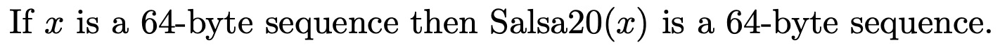
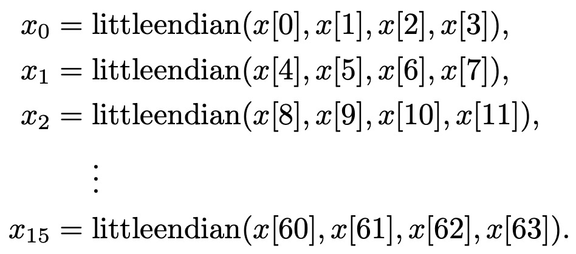
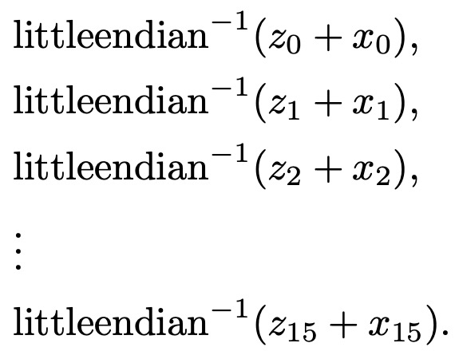
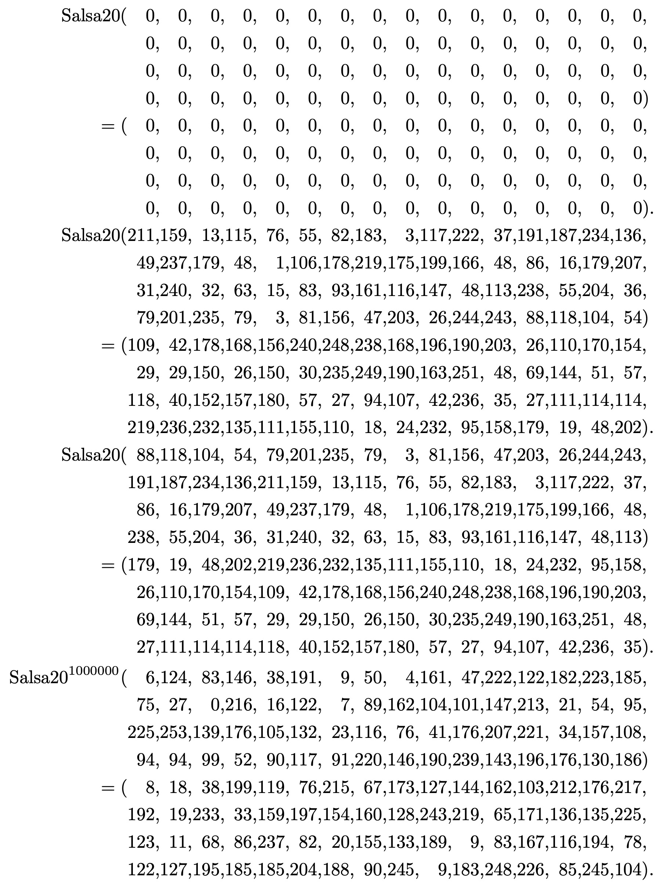

## The Salsa20 Hash function

The definitions below can be found in [HashSalsa20.hs](https://github.com/harrisonwl/rwcrypto/blob/main/src/salsa20/HashSalsa20.hs) and the testing code can be found in [Test_HashSalsa20.hs](https://github.com/harrisonwl/rwcrypto/blob/main/src/salsa20/Test_HashSalsa20.hs).

### Inputs and Outputs

<!-- <p align="center"></p> -->

If \\(x\\) is a 64-byte sequence, then \\(\mbox{Salsa20}(x)\\) is also a 64-byte sequence. Rendered in Haskell/ReWire types, we define a function with the following type:
```haskell
hash_salsa20 :: X64 (W 8) -> X64 (W 8)
```

### Definition

Bernstein's definition of the hash function, \\(\mbox{Salsa20}\\), is more involved than previous functions. It involves three steps. 

  1. For 64-byte input sequence \\(x = (x[0],\ldots,x[63])\\),
define 16-byte sequence, \\((x_0,\ldots,x_{15})\\) as:
<p align="center"></p>

  2. Define \\((z_0,\ldots,z_{15}) = \mbox{doubleround}^{10}(x_0,\ldots,x_{15})\\)
  
  3. Define \\(\mbox{Salsa20}(x)\\), as the concatenation of the following:
<p align="center"></p>

#### Rendering in ReWire/Haskell

Steps 1.-3. above are rendered in ReWire/Haskell as:

```haskell
hash_salsa20 :: X64 (W 8) -> X64 (W 8)
hash_salsa20 (X64   x_0  x_1  x_2  x_3  x_4  x_5  x_6  x_7  x_8  x_9 x_10 x_11 x_12 x_13 x_14 x_15
                   x_16 x_17 x_18 x_19 x_20 x_21 x_22 x_23 x_24 x_25 x_26 x_27 x_28 x_29 x_30 x_31
                   x_32 x_33 x_34 x_35 x_36 x_37 x_38 x_39 x_40 x_41 x_42 x_43 x_44 x_45 x_46 x_47
                   x_48 x_49 x_50 x_51 x_52 x_53 x_54 x_55 x_56 x_57 x_58 x_59 x_60 x_61 x_62 x_63 )
                        = X64
                             a00 a01 a02 a03 a10 a11 a12 a13 a20 a21 a22 a23 a30 a31 a32 a33
                             a40 a41 a42 a43 a50 a51 a52 a53 a60 a61 a62 a63 a70 a71 a72 a73
                             a80 a81 a82 a83 a90 a91 a92 a93 aa0 aa1 aa2 aa3 ab0 ab1 ab2 ab3
                             ac0 ac1 ac2 ac3 ad0 ad1 ad2 ad3 ae0 ae1 ae2 ae3 af0 af1 af2 af3
   where
     x0 , x1 , x2 , x3 , x4 , x5 , x6 , x7 , x8 , x9 , x10 , x11 , x12 , x13 , x14 , x15 :: W 32
     x0  = littleendian (  x_0 ,  x_1 ,  x_2 ,  x_3 )
     x1  = littleendian (  x_4 ,  x_5 ,  x_6 ,  x_7 )
     x2  = littleendian (  x_8 ,  x_9 , x_10 , x_11 )
     x3  = littleendian ( x_12 , x_13 , x_14 , x_15 )
     x4  = littleendian ( x_16 , x_17 , x_18 , x_19 )
     x5  = littleendian ( x_20 , x_21 , x_22 , x_23 )
     x6  = littleendian ( x_24 , x_25 , x_26 , x_27 )
     x7  = littleendian ( x_28 , x_29 , x_30 , x_31 )
     x8  = littleendian ( x_32 , x_33 , x_34 , x_35 )
     x9  = littleendian ( x_36 , x_37 , x_38 , x_39 )
     x10 = littleendian ( x_40 , x_41 , x_42 , x_43 )
     x11 = littleendian ( x_44 , x_45 , x_46 , x_47 )
     x12 = littleendian ( x_48 , x_49 , x_50 , x_51 )
     x13 = littleendian ( x_52 , x_53 , x_54 , x_55 )
     x14 = littleendian ( x_56 , x_57 , x_58 , x_59 )
     x15 = littleendian ( x_60 , x_61 , x_62 , x_63 )

     dr10 :: Hex (W 32) -> Hex (W 32)
     dr10 = doubleround . doubleround . doubleround . doubleround . doubleround .
              doubleround . doubleround . doubleround . doubleround . doubleround 

     z0 , z1 , z2 , z3 , z4 , z5 , z6 , z7 , z8 , z9 , z10 , z11 , z12 , z13 , z14 , z15 :: W 32
     (X16 z0 z1 z2 z3 z4 z5 z6 z7 z8 z9 z10 z11 z12 z13 z14 z15)
           = dr10 (X16 x0 x1 x2 x3 x4 x5 x6 x7 x8 x9 x10 x11 x12 x13 x14 x15)

     (a00 , a01 , a02 , a03) = inv_littleendian (z0 + x0)
     (a10 , a11 , a12 , a13) = inv_littleendian (z1 + x1)
     (a20 , a21 , a22 , a23) = inv_littleendian (z2 + x2)
     (a30 , a31 , a32 , a33) = inv_littleendian (z3 + x3)
     (a40 , a41 , a42 , a43) = inv_littleendian (z4 + x4)
     (a50 , a51 , a52 , a53) = inv_littleendian (z5 + x5)
     (a60 , a61 , a62 , a63) = inv_littleendian (z6 + x6)
     (a70 , a71 , a72 , a73) = inv_littleendian (z7 + x7)

     (a80 , a81 , a82 , a83) = inv_littleendian (z8 + x8)
     (a90 , a91 , a92 , a93) = inv_littleendian (z9 + x9)
     (aa0 , aa1 , aa2 , aa3) = inv_littleendian (z10 + x10)
     (ab0 , ab1 , ab2 , ab3) = inv_littleendian (z11 + x11)
     (ac0 , ac1 , ac2 , ac3) = inv_littleendian (z12 + x12)
     (ad0 , ad1 , ad2 , ad3) = inv_littleendian (z13 + x13)
     (ae0 , ae1 , ae2 , ae3) = inv_littleendian (z14 + x14)
     (af0 , af1 , af2 , af3) = inv_littleendian (z15 + x15)
```

### Examples

Bernstein's specification provides several sanity checks:
<p align="center"></p>

And these sanity checks are rendered in ReWire/Haskell as follows (each returns `True`):
```haskell
test1 :: Bool
test1 = hash_salsa20 i1 == i1

i1 :: X64 (W 8)
i1 = x64 0 0 0 0 0 0 0 0
         0 0 0 0 0 0 0 0
         0 0 0 0 0 0 0 0
         0 0 0 0 0 0 0 0
         0 0 0 0 0 0 0 0
         0 0 0 0 0 0 0 0
         0 0 0 0 0 0 0 0
         0 0 0 0 0 0 0 0 

i2 :: X64 (W 8)
i2 = x64 211 159 13 115 76 55 82 183
           3 117 222 37 191 187 234 136
          49 237 179 48 1 106 178 219
         175 199 166 48 86 16 179 207
          31 240 32 63 15 83 93 161
         116 147 48 113 238 55 204 36
          79 201 235 79 3 81 156 47
         203 26 244 243 88 118 104 54

o2 :: X64 (W 8)
o2 = x64 109 42 178 168 156 240 248 238
         168 196 190 203 26 110 170 154
          29 29 150 26 150 30 235 249
         190 163 251 48 69 144 51 57
         118 40 152 157 180 57 27 94
         107 42 236 35 27 111 114 114
         219 236 232 135 111 155 110 18
          24 232 95 158 179 19 48 202

test2 :: Bool
test2 = hash_salsa20 i2 == o2

i3 , o3 :: X64 (W 8)

i3 = x64 88 118 104 54 79 201 235 79 3 81 156 47 203 26 244 243 191 187 234 136 211 159 13 115 76 55 82 183 3 117 222 37 86 16 179 207 49 237 179 48 1 106 178 219 175 199 166 48 238 55 204 36 31 240 32 63 15 83 93 161 116 147 48 113

o3 = x64 179 19 48 202 219 236 232 135 111 155 110 18 24 232 95 158 26 110 170 154 109 42 178 168 156 240 248 238 168 196 190 203 69 144 51 57 29 29 150 26 150 30 235 249 190 163 251 48 27 111 114 114 118 40 152 157 180 57 27 94 107 42 236 35

test3 :: Bool
test3 = hash_salsa20 i3 == o3
```
