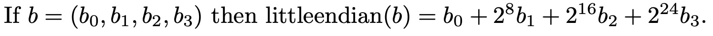
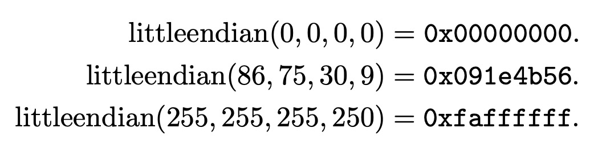

## The littleendian function


### Inputs and Outputs

To quote Bernstein: *If `b` is a 4-byte sequence then `littleendian(b)` is a word*, and, hence, its Haskell type is:
```haskell
littleendian :: Quad (W 8) -> W 32     -- i.e., (W 8, W 8, W 8, W 8) -> W 32
```

Bernstein also notes that `littleendian` is invertible, meaning that the following function can be defined:
```haskell
inv_littleendian :: W 32 -> Quad (W 8)
```

### Definition

<p align="center"></p>


#### Rendering in ReWire/Haskell

Note that the `(++)` operator below is vector concatenation (rather than list append from the Haskell prelude). So, in the definition of `littleendian` below, four `(W 8)` bit vectors (i.e., `b3`, `b2`, `b1`, and `b0`) are concatenated to make a single `(W 32)`.

```haskell
revbytes :: Quad (W 8) -> Quad (W 8) 
revbytes (b0,b1,b2,b3) = (b3,b2,b1,b0)

littleendian :: Quad (W 8) -> W 32   
littleendian w8x4 = b3 ++ b2 ++ b1 ++ b0
  where
    b0 , b1 , b2 , b3 :: W 8
    (b3 , b2 , b1 , b0) = revbytes w8x4
```

Bernstein also notes that `littleendian` is invertible:
```haskell
inv_littleendian :: W 32 -> Quad (W 8)
inv_littleendian w = revbytes (slice0 w , slice1 w , slice2 w , slice3 w)
```

Here, the operation of the slice functions (`slice0`, etc.) is illustrated by the following test:
```haskell
slicetest :: P.Bool
slicetest = (slice0 x , slice1 x , slice2 x , slice3 x) P.== (lit 0xde , lit 0xad , lit 0xbe , lit 0xef)
  where
    x :: W 32
    x = lit 0xdeadbeef
```
These functions are defined in `LittleEndian.hs` and are uninteresting.

### Examples


<p align="center"></p>

```haskell
alltests :: [P.Bool]
alltests = [test1 , test2 , test3] P.++ invertible_tests

test1 , test2 , test3 :: P.Bool 
test1 = littleendian (lit 0,lit 0,lit 0,lit 0)         == lit 0x00000000
test2 = littleendian (lit 86,lit 75,lit 30,lit 9)      == lit 0x091e4b56
test3 = littleendian (lit 255,lit 255,lit 255,lit 250) == lit 0xfaffffff

invertible_tests :: [P.Bool]
invertible_tests = [ invert q0 P.== q0
                   , invert q1 P.== q1
                   , invert q2 P.== q2
                   ]
   where
     invert :: Quad (W 8) -> Quad (W 8)
     invert q = inv_littleendian (littleendian q)
```

```haskell
λ> slicetest
True
λ> alltests
[True,True,True,True,True,True]
```
