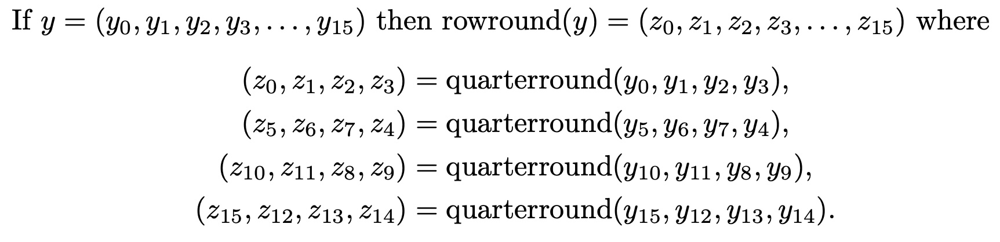
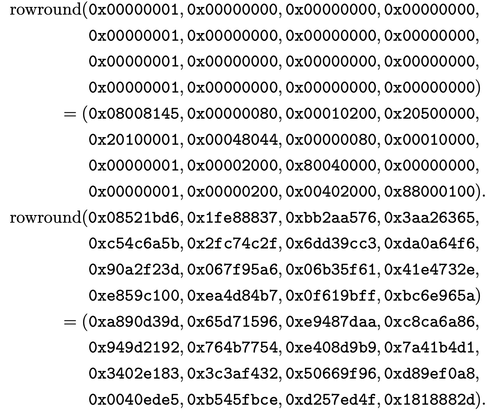

## The `rowround` Function

The definitions below can be found in [RowRound.hs](https://github.com/harrisonwl/rwcrypto/blob/main/src/salsa20/RowRound.hs) and the testing code can be found in [Test_RowRound.hs](https://github.com/harrisonwl/rwcrypto/blob/main/src/salsa20/Test_RowRound.hs).

### Inputs and Outputs

The `rowround` function takes a 16-word sequence as input and produces a 16-word sequence as output, meaning that the function will have type:
```haskell
rowround :: X16 (W 32) -> X16 (W 32)
```
where `X16` is a vector type defined by:
```haskell
data X16 a = X16 a a a a a a a a a a a a a a a a
```

We could have instead used either Haskell's built-in tuple or vector types defined by ReWire. But the advantage of the *roll-your-own* vector type `X16` as we do is that it makes both pattern-matching and displaying values at the GHCi prompt. Exactly how and why is not important for understanding this reference semantics for Salsa20, but a Haskell aficionado will undoubtedly notice this choice.

### Definition

<p align="center"></p>


## Rendering in ReWire/Haskell

Rendered in Haskell, it is:

```haskell
rowround :: X16 (W 32) -> X16 (W 32)
rowround (X16 y0 y1 y2 y3 y4 y5 y6 y7 y8 y9 y10 y11 y12 y13 y14 y15)
   = X16 z0 z1 z2 z3 z4 z5 z6 z7 z8 z9 z10 z11 z12 z13 z14 z15
     where
       ( z0,  z1,  z2,  z3) = quarterround ( y0,  y1,  y2,  y3)
       ( z5,  z6,  z7,  z4) = quarterround ( y5,  y6,  y7,  y4)
       (z10, z11,  z8,  z9) = quarterround (y10, y11,  y8,  y9)
       (z15, z12, z13, z14) = quarterround (y15, y12, y13, y14)
```


## Examples

<p align="center"></p>

```haskell
alltests :: [Bool]
alltests = [test1 , test2]

test1 , test2 :: Bool
test1 = rowround (x16
                    0x00000001 0x00000000 0x00000000 0x00000000
                    0x00000001 0x00000000 0x00000000 0x00000000
                    0x00000001 0x00000000 0x00000000 0x00000000
                    0x00000001 0x00000000 0x00000000 0x00000000)
                   == x16
                        0x08008145 0x00000080 0x00010200 0x20500000
                        0x20100001 0x00048044 0x00000080 0x00010000
                        0x00000001 0x00002000 0x80040000 0x00000000
                        0x00000001 0x00000200 0x00402000 0x88000100

test2 = rowround (x16
                    0x08521bd6 0x1fe88837 0xbb2aa576 0x3aa26365
                    0xc54c6a5b 0x2fc74c2f 0x6dd39cc3 0xda0a64f6
                    0x90a2f23d 0x067f95a6 0x06b35f61 0x41e4732e
                    0xe859c100 0xea4d84b7 0x0f619bff 0xbc6e965a )
                   == x16
                        0xa890d39d 0x65d71596 0xe9487daa 0xc8ca6a86
                        0x949d2192 0x764b7754 0xe408d9b9 0x7a41b4d1
                        0x3402e183 0x3c3af432 0x50669f96 0xd89ef0a8
                        0x0040ede5 0xb545fbce 0xd257ed4f 0x1818882d
```

```haskell
λ> alltests
[True,True]
```
